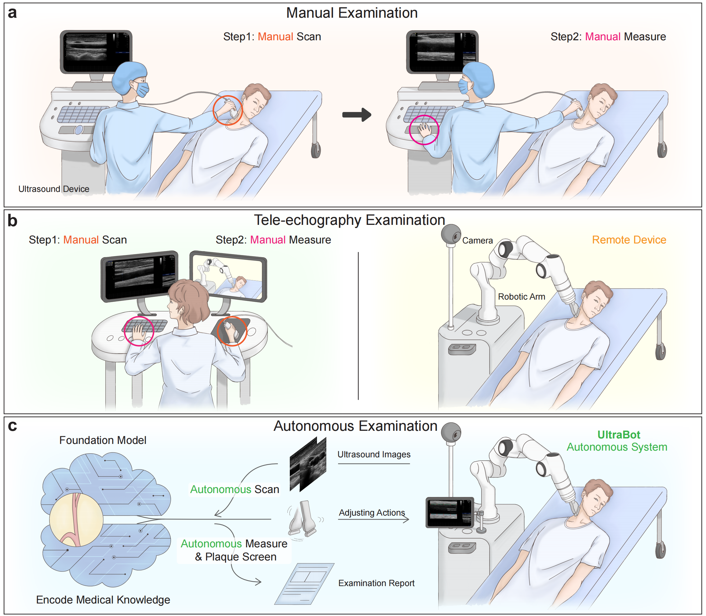

# Carotid UltraBot

<p align="center">  </p>

This repository is the official Pytorch implementation for Carotid UltraBot.

> **Title**:&emsp;&emsp;**Towards Expert-level Autonomous Carotid Ultrasonography with Large-scale Learning-based Robotic System**  
> **Authors**:&nbsp;&nbsp;Haojun Jiang<sup>🏀🌟</sup>, Andrew Zhao<sup>🌟</sup>, Qian Yang<sup>🌟</sup>, Xiangjie Yan, Teng Wang, Yulin Wang, Ning Jia, Jiangshan Wang, Guokun Wu, Yang Yue, Shaqi Luo, Huanqian Wang, Ling Ren, Siming Chen, Pan Liu, Guocai Yao, Wenming Yang, Shiji Song, Xiang Li, Kunlun He<sup>👑</sup>, Gao Huang<sup>👑</sup>   (<sup>🌟</sup> Equal Contribution, <sup>🏀</sup> Project Lead, <sup>👑</sup> Corresponding Author)  
> **Institute**: 1 Department of Automation, Tsinghua University  
> &nbsp;&nbsp; &nbsp;&nbsp; &nbsp;&nbsp;&nbsp;&nbsp;&nbsp;&nbsp;&nbsp;&nbsp;&nbsp; 2 Air Force Medical Center  
> &nbsp;&nbsp; &nbsp;&nbsp; &nbsp;&nbsp;&nbsp;&nbsp;&nbsp;&nbsp;&nbsp;&nbsp;&nbsp; 3 Beijing Academy of Artificial Intelligence  
> &nbsp;&nbsp; &nbsp;&nbsp; &nbsp;&nbsp;&nbsp;&nbsp;&nbsp;&nbsp;&nbsp;&nbsp;&nbsp; 4 Shenzhen International Graduate School, Tsinghua University  
> &nbsp;&nbsp; &nbsp;&nbsp; &nbsp;&nbsp;&nbsp;&nbsp;&nbsp;&nbsp;&nbsp;&nbsp;&nbsp; 5 Chinese PLA General Hospital  
> &nbsp;&nbsp; &nbsp;&nbsp; &nbsp;&nbsp;&nbsp;&nbsp;&nbsp;&nbsp;&nbsp;&nbsp;&nbsp; 6 Beijing National Research Center for Information Science and Technology, Tsinghua University  
> &nbsp;&nbsp; &nbsp;&nbsp; &nbsp;&nbsp;&nbsp;&nbsp;&nbsp;&nbsp;&nbsp;&nbsp;&nbsp; 7 Beijing LeadVision Ltd  
> **Publish**:&nbsp;&nbsp;&nbsp; **Nature Communications 2025 (IF=17.2)**  
> **Contact**:&nbsp;&nbsp; jianghaojunthu at 163 dot com / jhj20 at mails dot tsinghua dot edu dot cn

<h3 align="center">
Links: <a href="https://www.nature.com/articles/s41467-025-62865-w">Paper</a> | <a href="https://www.nature.com/articles/s41467-025-62865-w#additional-information:~:text=First%20Demonstration%20of,with%20Plaque%20Video">Demo</a> |  <a href="https://www.tsinghua.edu.cn/info/1175/121057.htm"> NatureBE Research Highlights</a>  | <a href="https://www.tsinghua.edu.cn/info/1175/121057.htm">清华新闻Tsinghua News</a> | <a href="https://mp.weixin.qq.com/s/YJqVwwHct0YfVJLwJC9GwA">清华自动化新闻Tsinghua DA News</a> | <a href="https://mp.weixin.qq.com/s/WqzrJ_DXyhiaQs5TVlaDEQ">医工学人报道</a> | <a href="https://mp.weixin.qq.com/s/SEsCNWsoPUPPZqOfBRf2QQ">CVer报道</a>
</h3>

## News
- Update on 2025/10/22: Our work highlighted by the **Chief Editor** of [Nature Biomedical Engineering](https://www.nature.com/articles/s41551-025-01546-x).
- Update on 2025/09/22: Haojun Jiang will present this as a poster at the MICCAI ASMUS on September 27th.  
- Update on 2025/08/23: Finally, the paper is online now! 🎉 
- Update on 2025/07/30: Accepted by Nature Communications and in production. STAR ⭐ this repo to get notified upon publication.
- Update on 2025/07/03: Release the code.

## Abstract

Carotid ultrasound requires skilled operators due to small vessel dimensions and high anatomical variability, exacerbating sonographer shortages and diagnostic inconsistencies. Prior automation attempts, including rule-based approaches with manual heuristics and reinforcement learning trained in simulated environments, demonstrate limited generalizability and fail to complete real-world clinical workflows. Here, we present UltraBot, a fully learning-based autonomous carotid ultrasound robot, achieving human-expert-level performance through **_four innovations_**:  
**(1)** A unified imitation learning framework for acquiring anatomical knowledge and scanning operational skills;  
**(2)** A large-scale expert demonstration dataset (247,000 samples, 100 times scale-up), enabling embodied foundation models with strong generalization;  
**(3)** A comprehensive scanning protocol ensuring full anatomical coverage for biometric measurement and plaque screening;  
**(4)** The clinical-oriented validation showing over 90\% success rates, expert-level accuracy, up to 5.5× higher reproducibility across diverse unseen populations.  
Overall, we show that large-scale deep learning offers a promising pathway toward autonomous, high-precision ultrasonography in clinical practice.

## Demo: autonomous scanning, biometric measurement, and plaque screening.

For more demos, please refer to Supplementary Videos 1-3 in the article.

<p align="center">  </p>


## Usage

This project consists of three main components:

- **action_decision**: Responsible for autonomous robotic decision-making during carotid ultrasound scanning.
- **biometric_measurement**: Handles anatomical landmark detection and automatic measurement of carotid intima-media thickness and lumen diameter.
- **plaque_segmentation**: Focuses on identifying and segmenting carotid plaques from ultrasound images.

Each module is organized in its respective subdirectory and includes a dedicated `README.md` file with detailed instructions on setup, training, and inference. Please refer to the `README.md` inside each folder for component-specific usage and guidelines.

## Reference

If you find our project useful in your research, please consider citing:

```
@article{jiang2025towards,
  title={Towards expert-level autonomous carotid ultrasonography with large-scale learning-based robotic system},
  author={Jiang, Haojun and Zhao, Andrew and Yang, Qian and Yan, Xiangjie and Wang, Teng and Wang, Yulin and Jia, Ning and Wang, Jiangshan and Wu, Guokun and Yue, Yang and others},
  journal={Nature Communications},
  volume={16},
  number={1},
  pages={7893},
  year={2025},
  publisher={Nature Publishing Group UK London}
}
```

## Contacts
jhj20 at mails dot tsinghua dot edu dot cn / jianghaojunthu at 163 dot com

Any discussions or concerns are welcomed!
