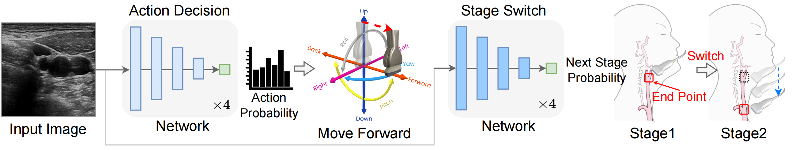

# Deep Learning for Autonomous Scanning

<p align="center">  </p>

## Key Features

This repository contains code for training and evaluating imitation learning models for artery scanning. The system is designed to learn actions for ultrasound probe control based on image data.

## Environment Setup

### Requirements

The following packages are required:

```
torch>=1.8.0
torchvision>=0.9.0
numpy
pandas
Pillow
tqdm
easydict
tensorboard
```

### Installation

1. Clone the repository:
```bash
git clone <repository-url>
cd action_decision
```

2. Create and activate a conda environment (recommended):
```bash
conda create -n artery_scan python=3.8
conda activate artery_scan
```

3. Install the required packages:
```bash
pip install torch torchvision numpy pandas Pillow tqdm easydict tensorboard
```

## Data Preparation

The training script expects a metadata CSV file (by default at `data/meta.csv`) that contains paths to the training images and their corresponding actions. The expected format includes:

- `path`: Path to the image file
- `action_key`: The action key associated with the image (one of 'u', 'i', 'o', 'j', 'k', 'l', '7', '8', '9', '4', '5', '6', 'x')
- `supervise_distance`: Boolean indicating whether to supervise distance
- `d1` through `d6`: Distance values

## Training

To train the imitation learning model, use the `train.py` script. Example usage:

```bash
python train.py \
    --arch resnet50 \
    --log-dir logs \
    --exp-name my_experiment \
    --batch-size 256 \
    --epochs 10 \
    --lr 0.0001 \
    --data_source data/meta.csv \
    --stage 1
```

### Important Parameters

- `--arch`: Neural network architecture (default: resnet50)
- `--log-dir`: Directory to save logs and checkpoints
- `--exp-name`: Experiment name
- `--batch-size`: Batch size for training
- `--epochs`: Number of epochs
- `--lr`: Learning rate
- `--data_source`: Path to metadata CSV file
- `--stage`: Training stage
- `--resume`: Path to a checkpoint to resume training

### Distributed Training

The code supports distributed training across multiple GPUs. Make sure to set the following environment variables before running the training script:

```bash
export WORLD_SIZE=<number_of_gpus>
export RANK=<rank_of_current_process>
export LOCAL_RANK=<local_rank_of_current_process>
```

## Evaluation

To evaluate a trained model, use the `eval.py` script:

```bash
python eval.py \
    --data_path test_set/stage1 \
    --model_path logs/stage1/all-fold/resnet50/checkpoint-best.pth.tar \
    --last_n 1 \
    --offset 1
```

### Evaluation Parameters

- `--data_path`: Path to the test data directory
- `--model_path`: Path to the trained model checkpoint
- `--last_n`: Number of last samples to consider for prediction
- `--offset`: Offset for evaluation

## Action Keys

The model is trained to predict one of 13 different actions. For a more intuitive understanding, please refer to Fig. 3b in the main text.

| Key | Action Description |
|-----|-------------------|
| 'u' | up |
| 'i' | forward |
| 'o' | down |
| 'j' | left |
| 'k' | back |
| 'l' | right |
| '9' | yaw clockwise |
| '7' | yaw anti-clockwise |
| '8' | pitch clockwise |
| '5' | pitch anti-clockwise |
| '6' | roll clockwise |
| '4' | roll anti-clockwise |
| 'x' | stop |