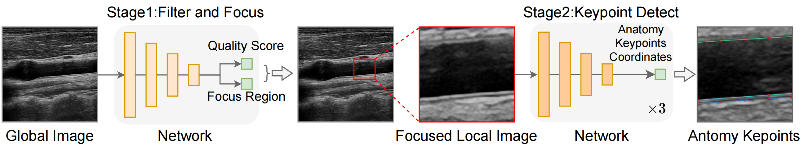
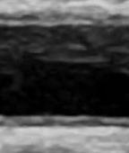
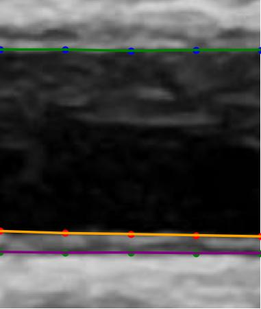

# Deep Learning for Biometric Measurement

<p align="center">  </p>

## Key Features

This repository provides the code for the **biometric measurement** part of the paper *Towards Expert-level Autonomous Carotid Ultrasonography with Large-scale Learning-based Robotic System*.

- Our objective is to develop a system capable of automatically calculating carotid lumen diameter (CALD) and intima-media thickness (CIMT) values based on patients' carotid artery ultrasound images during the autonomous scanning process.
- we break down the problem into two stages. The first stage aims to ascertain the presence and location of clear internal membrane structures of the carotid artery in images. If a clear internal membrane structure is detected, the second stage is utilized to calculate CALD and CIMT values. 

## Preparation

```bash
conda create --name mea python=3.9
conda activate mea
pip install -r requirements.txt
```

## Training

- Before training, please check the related parameters, e.g., epochs, fold, batch_size, seed.
- Replace the data csv path and log path.
- First, run the stage1 code, then incorporate the stage1 results into the dataset and run the stage2 code.

**Stage1**
```bash
cd biometric_measurement/train
CUDA_VISIBLE_DEVICES=0,1 torchrun --nproc_per_node=2 --master_port 29506 --max_restarts=0 stage1_filter_and_focus.py -a resnet50 -b 256 --lr 0.001 --input_size 256 --scheduler cosine --epochs 50 --exp-name 'split_by_patient/stage1_cls_and_reg' -j 4 --log-dir logs_stage1 --wd 1e-5 --fold 0 --dropout 0 --print_freq 1 --seed 42 --normalizer imagenet --gaussian 0 --colorjitter 0 --mse_loss_ratio 1.0 --ciou_loss_ratio 8.0 --csv_path_1 ... --csv_path_2 ...
```

**Stage2**
```bash
cd biometric_measurement/train
CUDA_VISIBLE_DEVICES=0,1 torchrun --nproc_per_node=2 --master_port 29507 --max_restarts=0 stage2_keypoint_detect.py -a resnet50 -b 128 --lr 0.0001 --input_size 256 --scheduler cosine --epochs 100 --exp-name 'resample' -j 4 --log-dir logs_stage2 --gaussian 0 --wd 1e-5 --fold 0 --dropout 0 --print_freq 1 --seed 42 --normalizer imagenet --colorjitter 0 --linear_init_std 0.001 --angle_loss_ratio 0.0000
```

## Inference
- Before inference, please make sure to replace the placeholder paths in the command with your actual file paths.
- Download the best model weights 'best_mea_model.pth.tar' from [this link](https://drive.google.com/file/d/1lkPsWRsRhJFgDd83OLREQiZ9eZ93V9qB/view?usp=sharing) and place it in an appropriate directory.
- **Please ensure that for each pixel in the input image, the three channel values are identical**.


```bash
cd biometric_measurement/inference
python inference.py --image /path/input/1.jpg --json /path/input/1.json --pretrain /path/ckpt/best_mea_model.pth.tar --output-dir /path/output
```

**Visualization of Input and Output**

<table>
  <tr>
    <th>Input Image</th>
    <th>Visualization of Output</th>
  </tr>
  <tr>
    <td></td>
    <td></td>
  </tr>
</table>
