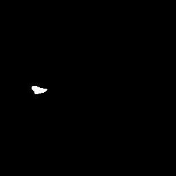

# Deep Learning for Plaque Segmentation
<p align="center">  </p>

## Key Features

This repository provides the code for the **plaque segmentation** part of the paper *Towards Expert-level Autonomous Carotid Ultrasonography with Large-scale Learning-based Robotic System*.

- We propose a dual-branch multi-scale network with detection prior, named DFMS-Net, for more accurate carotid plaque segmentatio
- The framework introduces a vessel wall localization stage, where a detection model is used to capture coarse spatial cues of the wall region. These spatial priors are then embedded into the segmentation model to guide learning

## Preparation

```bash
conda create --name cps python=3.9
conda activate cps
pip install -r requirements.txt
```

## Training

- Before training, please check the related parameters, e.g., epoch_num, device_id, batch_size, seed.
- Replace the data path and output path.
- First, run the vessel wall detection code, then incorporate the detection results into the dataset and run the plaque segmentation code.


**Train vessel wall detection model**

```bash
cd plaque_segmentation/train
python train_detection.py --epoch_num 100 --train_batch_size 2 --device_id 0 --output_dir 'path' --detetion_data_root 'path' 
```

**Train plaque segmentation model with detection prior**

```bash
cd plaque_segmentation/train
python train_segmentation.py --epoch_num 100 --train_batch_size 2 --device_id 0 --seed 0 --ckpt_path 'path' --data_root 'path' --exp_name 'DFMS_first_train'
```

##  Inference

- Before inference, please make sure to replace the placeholder paths in the command with your actual file paths.
- Download the best model weights 'best_seg_model.pth' from [this link](https://drive.google.com/file/d/1YJRzv9wy6yPjFydjJROBPyj3BhM2AzxE/view?usp=sharing) and place it in an appropriate directory.

```bash
cd plaque_segmentation/inference
python inference.py --model_path /path/ckpt/best_seg_model.pth --image_path /path/input/1.jpg --det_path /path/input/1_det.jpg --save_mask_path /path/output/1_mask.jpg --save_vis_path /path/output/1_vis.jpg
```
**Visualization of Input and Output**

| Original Input Image                     | Detection Prior Input                            |
| ---------------------------------------- | ------------------------------------------------ |
|   |   |

| Predicted Mask Output                          | Visualization of Segmentation Result                   |
| ---------------------------------------------- | ------------------------------------------------------ |
|   |   |
